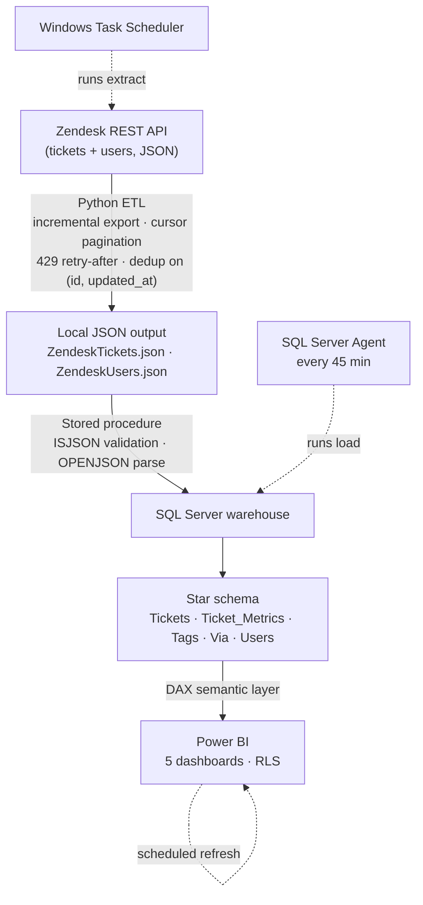

# IT Support Analytics Pipeline — Zendesk → SQL Server → Power BI

An end-to-end analytics pipeline that pulls helpdesk data from the Zendesk API,
lands and models it into a governed **star-schema warehouse** on SQL Server, and
serves it through a **DAX semantic layer** in Power BI — refreshing itself on a
**45-minute** automated cadence.

> **Note.** Built at **The Michener Institute of Education at UHN (Toronto)**.
> This repo uses **fully synthetic sample data** — no real tickets, users, or
> identifiers are included. Architecture, schema, and ETL logic reflect the
> production system; the data does not.

---

## The problem

Helpdesk reporting was rebuilt by hand every week from Zendesk exports pasted into
PowerPoint. It took roughly **20 hours a week**, arrived stale, and each team used a
slightly different definition of "resolution time," so leadership debated the numbers
instead of acting on them.

## What I built

A single automated pipeline that became the team's one source of truth:

- **Python extraction** from the Zendesk API — incremental ticket export with
  `metric_sets`, cursor pagination for users, HTTP 429 rate-limit handling with the
  `retry-after` header, and **deduplication** on `(id, updated_at)`. Loads **5+ years**
  of history (from 2019) plus ongoing incremental data.
- **SQL Server warehouse** — a stored procedure parses nested JSON with `OPENJSON`
  into typed relational tables (Tickets, Ticket_Metrics, Tags, Via, Users), validated
  with `ISJSON` before load and modeled as a **star schema**.
- **Power BI semantic layer** — a **DAX** model over 5 dashboards covering SLA
  compliance, backlog aging, first-response and resolution times, reopen rate, and
  agent productivity.
- **Automation** — Windows Task Scheduler runs the extract; a SQL Server Agent job
  runs the load stored procedure every 45 minutes; Power BI refreshes on top.
- **Data quality** — `ISJSON` validation, deduplication, and reconciliation of
  dashboard figures against Zendesk's native reports during testing.

## Results

- Replaced **~20 hours/week** of manual reporting with a **45-minute** automated refresh.
- **5+ years** of history ingested (2019 → present) into a governed warehouse.
- **5 Power BI dashboards** giving leadership a single source of truth.
- **~30%** fewer ad-hoc clarification requests after rollout (stakeholder estimate).

---

## Architecture



<details>
<summary>Text version of the data flow</summary>

```
Zendesk REST API (JSON)
   │  Python: incremental export, pagination, 429 retries, dedup on (id, updated_at)
   ▼
Local JSON output  ──►  SQL Server (SSMS)
                          │  Stored procedure: ISJSON validation, OPENJSON parse,
                          │  typed load into Tickets / Ticket_Metrics / Tags / Via / Users
                          ▼
                        Star-schema warehouse (fact + conformed dimensions)
                          │  Power BI: DAX semantic model, 5 dashboards, RLS
                          ▼
                        Automated refresh (Task Scheduler + SQL Server Agent, 45 min)
```

</details>

See [`docs/ARCHITECTURE.md`](docs/ARCHITECTURE.md) for the phase-by-phase build and
[`docs/DATA_DICTIONARY.md`](docs/DATA_DICTIONARY.md) for the table/field reference.

## Repository structure

```
├─ python_scripts/     # Zendesk API extraction (env-var auth, pagination, retries, dedup)
│  ├─ extract_zendesk.py
│  └─ .env.example
├─ sql_scripts/        # Stored procedure: JSON validation + OPENJSON load into star schema
│  └─ update_procedure.sql
├─ automation/         # Task Scheduler runner
│  └─ run_pipeline.ps1
├─ powerbi/            # Model screenshot, dashboard screenshots, .pbix (synthetic)
├─ docs/               # Architecture and data dictionary
├─ data_sample/        # SYNTHETIC sample JSON only (see HOW_TO_GENERATE.md)
├─ requirements.txt
└─ .gitignore
```

## Running it

1. `python -m venv .venv && .venv\Scripts\activate`
2. `pip install -r requirements.txt`
3. Copy `python_scripts/.env.example` to `.env`; add your Zendesk email, API token, subdomain.
4. `python python_scripts/extract_zendesk.py` → writes JSON to `./output/`.
5. In SSMS, run `sql_scripts/update_procedure.sql` to load the warehouse (point the
   `<OUTPUT_DIR>` paths at your output folder or pass them as the procedure's parameters).
6. Connect Power BI to the warehouse; schedule the extract via Task Scheduler and the
   load via SQL Server Agent.

## Tech stack

Python (`requests`, `pandas`, `python-dotenv`) · SQL Server / T-SQL (`OPENJSON`,
stored procedures, `MERGE`/UPSERT) · Power BI (DAX, Power Query/M, RLS) ·
Windows Task Scheduler · SQL Server Agent

## About

Built by **Jay Panchal** — BI Developer · Operations & Inventory Analyst, Toronto.
Portfolio: https://jayp881998.github.io · LinkedIn: https://www.linkedin.com/in/jaypanchal0808
